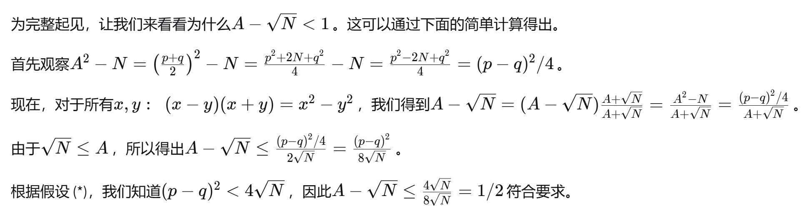

### 作业要求：
这一作业中我们将简要介绍 [RSA](https://ruanyifeng.com/blog/2013/06/rsa_algorithm_part_one.html) 加密方法，并在特殊情况下尝试破除 RSA。请大家**阅读下列材料**后，从拓展1，拓展2中**任选一例**完成。

#### RSA 密钥生成:

RSA加密中的所有运算都定义在模 $n$ 的剩余系下。一种经典的 RSA 密钥生成算法分为下面几步:

- step1: 生成两个大质数 $p,q$，$N := pq$
- step2: 挑选一个 $e > 1$, 且满足 $ \gcd(e, \phi(N)) = 1$
- step3: 求出满足同余方程 $de \equiv 1 \mod N$ 的唯一解 $d$
#### 用于加密的量：
- 公钥：$n, e$
- 私钥：$d$
- 明文：$msg$
- 加密：$ct = {msg}^e \mod n$
- 解密：$msg = {ct}^d \mod n$

由于分解 $N$ 得到 $p,q$ 需要的时间极长。所以在保证在 $d$ 不被窃取的前提下，仅能通过枚举分解 $N$ 破解，一般情况极难实现。

### 特殊情况：

但我们接下来探讨一种特殊情况，这种情况下，破解 RSA 是极为简单的。

通常，组成 RSA 模的素数是独立生成的。  但假设开发人员决定通过选择一个随机数
$R$
 并**扫描附近的素数来生成第一个素数**
$p$。  第二个质数
$q$ 是通过**扫描同样靠近**
$R$ 的其他随机质数生成的。

**不妨假设，生成的 $p, q$ 满足 $|p - q| < 2 N ^{1/4}$**.  

记 $A = \frac{p+q}{2}$, 由于 $p,q$ 均是奇素数，所以 $A$ 是整数. 注意到 $$0 < A - \sqrt{N} < 1 \text{ (}^{\star})$$ 

因此将 $\sqrt{N}$ **上取整**即可得到 $A$.

由于 $A$ 恰好是 $p$ 和 $q$ 之间的**中点**，因此存在整数 $x$, $$p = A - x, q = A + x$$
于是 $N = pq = (A - x)(A + x)$, 因此 $x = \sqrt{A^2 - N}$

下面我们补充证明$$0 < A - \sqrt{N} < 1$$

因此在 $(^*)$ 假设下，我们甚至花费 $O(1)$ 的时间就可以破解 RSA 密钥，于是我们可以把条件再次放宽。下面是两例拓展，请仿照上述方法，给出求 $p,q$ 的过程。

#### 拓展1：$|p-q|<2^{11}N^{1/4}$
hint: 用上文的方法找到 $A - \sqrt{N}$ 的上界

#### 拓展2：$|3p-2q|<N^{1/4}$
hint: 改写上文方法，求出 $\frac{3p + 2q}{2} - \sqrt{6N}$的上界

#### 进一步阅读：
上述方法是已知质因数的高阶位时，关于因式分解的一个 [更为普遍的结果](https://link.springer.com/chapter/10.1007/3-540-68339-9_14) 的简化版本。

### p.s.

这次作业是**提醒**同学们不要**自己实现密钥生成**，而是调用官方 RSA 库，否则当生成方式被窃取后，容易受到**数字分析**攻击（本次作业就是一例）

